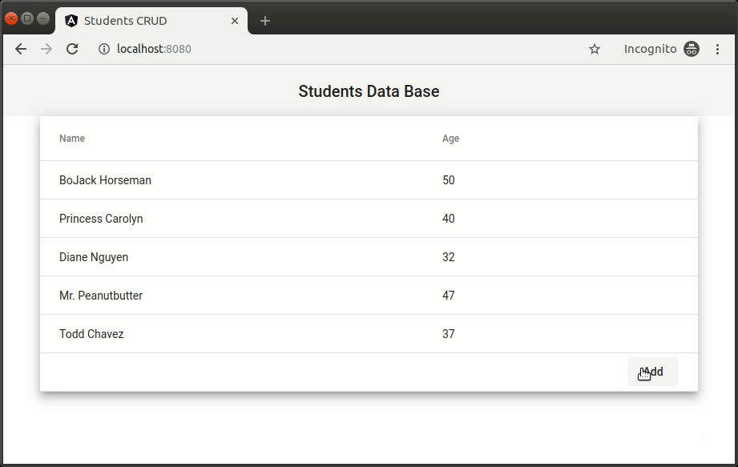

[](https://travis-ci.com/Shpota/go-angular)

A simple web application written with Go and Angular
===================================================
I implemented this application while evaluating Go. 
On the back end side, I used 
[gorilla/mux](https://github.com/gorilla/mux) for 
routing, [Gorm](https://github.com/jinzhu/gorm) as an 
ORM engine and 
[google/uuid](https://github.com/google/uuid) 
for UUID generation. On the front end side, I used 
[Angular 8](https://angular.io/) and 
[Angular Material](https://material.angular.io/).



## System requirements 
You need to have [Docker](https://www.docker.com) 
installed in order to build and run the application.
No additional tools required.

## How to build and run
1. Create a Docker network:
    ```shell script
    docker network create students-net
    ```
2. Start the DB:
    ```shell script
    docker run \
      -e POSTGRES_USER=go \
      -e POSTGRES_PASSWORD=your-strong-pass \
      -e POSTGRES_DB=go \
      --name students-db \
      --net=students-net \
      postgres:11.5
    ```
3. Build the application image:
    ```shell script
    docker build -t students-app .
    ```
4. Start the application container:
    ```shell script
    docker run -p 8080:8080 \
      -e DB_PASS='your-strong-pass' \
      --net=students-net students-app
    ```
Access the application via http://localhost:8080
